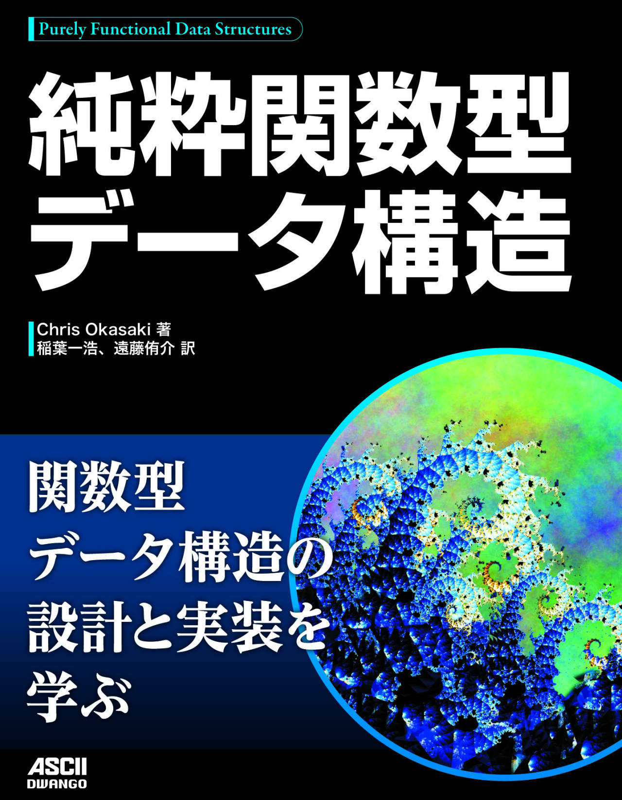

# 線形型の<br>刹那的不変データ構造への利用

## Haskell Day 2021

## 岡本和樹

----

# もくじ

- 線形型とは
- GHC での線形型
- linear-base ライブラリー
- 刹那的データ構造とは
- 線形型＋刹那的データ構造

----

# もくじ

- **線形型とは**
- GHC での線形型
- linear-base ライブラリー
- 刹那的データ構造とは
- 線形型＋刹那的データ構造

----

# 線形型とは

- GHC 9.0 で言語拡張としてサポート
- ｢値を一度だけ使う｣
  - ダメ 2回使う
  - ダメ 1回も使わない
- より厳密に型検査をしてもらえてうれしい
- コンパイラーがよりよい最適化ができてうれしい

----

# 線形型とは › 2つのスタイル

- 線形型関数を導入
  - 仮引数を1回だけ使う
- カインド（種）を拡張
  - 1回だけ使える型のカインド
  - 何回でも使える型のカインド
- GHC は線形型関数を採用

----

# 線形型とは › 線形型関数

- 普通の関数の型 $a \rightarrow b$
- 線形型関数の型 $a \multimap b$
  - 関数の中で $a$ 型の値は1回しか使えない

----

# もくじ

- 線形型とは
- **GHC での線形型**
- linear-base ライブラリー
- 刹那的データ構造とは
- 線形型＋刹那的データ構造

----

# GHC での線形型

- linear types 言語拡張（GHC 9.2 以降）
- $a \multimap b$ を `a %1-> b` と書く
- `a %1-> b` は `a %'One-> b` の別名
  - `'One` は data kinds 拡張によって持ち上げられた型
    - カインドは `Multiplicity`
- `a %'One-> b` は `FUN 'One a b` の別名
- これにともなって `a -> b` は `FUN 'Many a b` の別名に

```haskell
type FUN :: Multiplicity -> forall (r1 r2 :: RuntimeRep). TYPE r1 -> TYPE r2

data Multiplicity = One | Many
```

----

# GHC での線形型 › REPL で試す

linear types 言語拡張を有効にして REPL を起動

```
ghc --interactive -XLinearTypes
```

----

# GHC での線形型 › 2回使用したとき

```haskell
f :: Int %1-> (Int, Int)
f a = (a, a)
```

```
<interactive>:1:29: error:
    • Couldn't match type ‘'Many’ with ‘'One’
        arising from multiplicity of ‘a’
    • In an equation for ‘f’: f a = (a, a)
```

`f` の中で `a` を2回使っているのでエラーになる

----

# GHC での線形型 › 使用しないとき

```haskell
f :: Int %1-> (Int, Int)
f a = (1, 1)
```

```
<interactive>:2:29: error:
    • Couldn't match type ‘'Many’ with ‘'One’
        arising from multiplicity of ‘a’
    • In an equation for ‘f’: f a = (1, 1)
```

使用しないときも同じエラーになる

----

# GHC での線形型 › 部分型多相

multiplicity に関しても部分型多相はない

```haskell
f :: Int %1-> (Int, Int)
f a = (a, 1)

h :: Int -> (Int, Int)
h = f
```

```
<interactive>:4:29: error:
    • Couldn't match type ‘'One’ with ‘'Many’
      Expected: Int -> (Int, Int)
        Actual: Int %1 -> (Int, Int)
    • In the expression: f
      In an equation for ‘h’: h = f
```

----

# GHC での線形型 › イータ変換

これは妥当

```haskell
f :: Int %1-> (Int, Int)
f a = (a, 1)

h :: Int -> (Int, Int)
h a = f a
-- h = f -- これはダメ
```

安易にイータ変換してはいけない

----

# GHC での線形型 › パラメーター多相

multiplicity の部分も型変数にできる

```haskell
f :: a %m-> (a, Int)
f a = (a, 1)

g :: a -> (a, Int)
g = f

h :: Int %1-> (Int, Int)
h = f
```

----

# GHC での線形型 › パターンマッチ

```haskell
consume :: Bool %1-> ()
consume False -> ()
consume True -> ()
```

下記のように変えるとエラーになる

```haskell
consume :: Bool %1-> ()
consume _ -> ()
```

ワイルドカードには注意

----

# GHC での線形型 › let-in と case-of

- let-in 式での束縛は値が複数回使われたことにされる
- case-of 式でのパターンマッチは値が複数回使われたことにされる
  - 今の GHC での実装では
- 代わりにこうする
  - `Prelude.Linear` は linear-base パッケージのモジュール
  - `(PL.&)` は `(Data.Function.&)` の線形型版

```haskell
{-# LANGUAGE LambdaCase #-}

import qualified Prelude.Linear as PL

qux = foo bar PL.& \case Foo buzz -> buzz
```

----

# もくじ

- 線形型とは
- GHC での線形型
- **linear-base ライブラリー**
- 刹那的データ構造とは
- 線形型＋刹那的データ構造

----

# linear-base ライブラリー

- 線形型基本ライブラリー
  - Tweag 社が提供
  - GHC への線形型拡張を提案・実装した会社

----

# linear-base › 線形性の伝播

データ型のフィールドに線形性は伝播する

```haskell
type Title = String
type Author = String
data Book = Book Title Author

f :: Book %1-> (Title, Author, String)
f (Book t a) = (t, a, "")
-- f (Book t a) = (t, a, t) -- これはダメ
```

----

# linear-base › 線形性の伝播を止める

GADT（generalized algebraic data type・一般化代数的データ型）で `->` にすると伝播は止まる

先の `Book` を GADT にする

```haskell
data Book where
  Book :: Title -> Author -> Book
```

```haskell
f :: Book %1-> (Title, Author, String)
f (Book t a) = (t, a, t) -- これも OK に
```

----

# linear-base › `Ur`

GADT で定義されたデータ型で線形性の伝播を止めるために使う

```haskell
{-# LANGUAGE GADTs #-}

data Ur a where
  Ur :: a -> Ur a
```

線形型がなければこれは下記と同じ

```haskell
data Ur a = Ur a
```

----

# linear-base › 返り値の線形性

このような線形型恒等関数 `idl` があるとき

```haskell
idl :: a %1-> a
idl a = a
```

次のような `idl'` は妥当かどうか？

```haskell
idl' :: a %1-> a
idl' a = id (idl a)
```

----

# linear-base › 返り値も線形性

```haskell
idl' :: a %1-> a
idl' a = id (idl a)
```

これはエラーになる

----

# linear-base › 返り値への伝播を止めたい

返り値は何回も使っていいときは？

```haskell
notl :: Bool %1-> Bool
notl False = True
notl True = False

notl' :: Bool %1-> Bool
notl' a = id (notl a) -- エラー
```

----

# linear-base › 返り値への伝播を止める

これも `Ur` を使う

```haskell
notl :: Bool %1-> Ur Bool
notl False = Ur True
notl True = Ur False

notl' :: Bool %1-> (Bool, Bool)
notl' a = notl a LP.& \case Ur a -> (a, a)
```

----

# もくじ

- 線形型とは
- GHC での線形型
- linear-base ライブラリー
- **刹那的データ構造とは**
- 線形型＋刹那的データ構造

----

# 刹那的データ構造とは

- 計算量の関係から一度しか値を使うことができない

```haskell
-- ダメな例
ops =
  let
    q0 = empty
    q1 = enqueue 1 q0
    q1' = enqueue 2 q0 -- q0 を2回使っている
    Just (a, _) = dequeue q1
    Just (b, _) = dequeue q1'
  in
    (a, b)
```

----

# 刹那的データ構造とは ›<br>キュー



- 『純粋関数型データ構造』の 5.2 章のキューを題材に

----

# 刹那的データ構造とは › キュー › データ型

- FILO（リスト）を2つ用意して FIFO（キュー）を実装する
- enqueue のときは右側のリストの先頭に追加する
- dequeue のときは左側のリストの先頭から取得する
- enqueue・dequeue した後に左側のリストが空なら、右側のリストを反転して左側のリストとし、右側のリストを空にする
- 償却計算量が enqueue・dequeue ともに $O(1)$
  - ただし値は高々1回しか使えない
  - なぜ？書籍を参考のこと

----

# もくじ

- 線形型とは
- GHC での線形型
- linear-base ライブラリー
- 刹那的データ構造とは
- **線形型＋刹那的データ構造**

----

# 線形型＋刹那的データ構造 › データ型

```haskell
{-# LANGUAGE GADTs #-}
{-# LANGUAGE LinearTypes #-}
{-# LANGUAGE Strict #-}

data Queue a where
  Queue :: [a] -> [a] -> Queue a
```

- フィールドのリストは何度使ってもいいので GADT で定義する

----

# 線形型＋刹那的データ構造 › 操作

```haskell
empty :: (Queue a %1-> Ur b) %1 -> Ur b
empty k = k (Queue [] [])

null :: Queue a %1-> (Ur Bool, Queue a)
null (Queue l m) = (Ur (P.null l), Queue l m)

enqueue :: a -> Queue a %1-> Queue a
enqueue a (Queue l m) = check l (a:m)

dequeue :: Queue a %1-> (Ur (Maybe a), Queue a)
dequeue (Queue (a:l) m) = (Ur (Just a), check l m)
dequeue (Queue l m) = (Ur Nothing, Queue l m)

check :: [a] -> [a] -> Queue a
check [] m = Queue (reverse m) []
check l m = Queue l m
```

----

# 線形型＋刹那的データ構造 › empty

```haskell
empty :: (Queue a %1-> b) %1-> b
empty k = k (Queue [] [])
```

- 空キューの作成
- GHC では線形型は線形型関数なので継続にする
- `Queue [] []` を一度しか使えない

----

# 線形型＋刹那的データ構造 › null

```haskell
null :: Queue a %1-> (Ur Bool, Queue a)
null (Queue l m) = (Ur (P.null l), Queue l m)
```

- 空かどうかの検査
- `Queue` の定義に GADT を使ったので `l` を2回使える
- 結果は `Ur` に包んで返す
  - 線形性を引き継がないように

----

# 線形型＋刹那的データ構造 › enqueue・dequeue

```haskell
enqueue :: a -> Queue a %1-> Queue a
enqueue a (Queue l m) = check l (a:m)

dequeue :: Queue a %1-> (Ur (Maybe a), Queue a)
dequeue (Queue (a:l) m) = (Ur (Just a), check l m)
dequeue (Queue l m) = (Ur Nothing, Queue l m)

check :: [a] -> [a] -> Queue a
check [] m = Queue (reverse m) []
check l m = Queue l m
```

- `enqueue` は見たまま
- `dequeue` も結果は `Ur` にくるむ

----

# 線形型＋刹那的データ構造 › 使ってみる

```haskell
it "empty → enqueue → dequeue" $ do
  let
    f :: Queue Int %1 -> Ur Int
    f q =
      enqueue 0 q PL.& \q ->
      dequeue q PL.& \(Ur (Just a), q) ->
      q `lseq` Ur a
    Ur a = empty f
  a `shouldBe` 0
```

- 0 を enqueue して dequeue するだけの例
