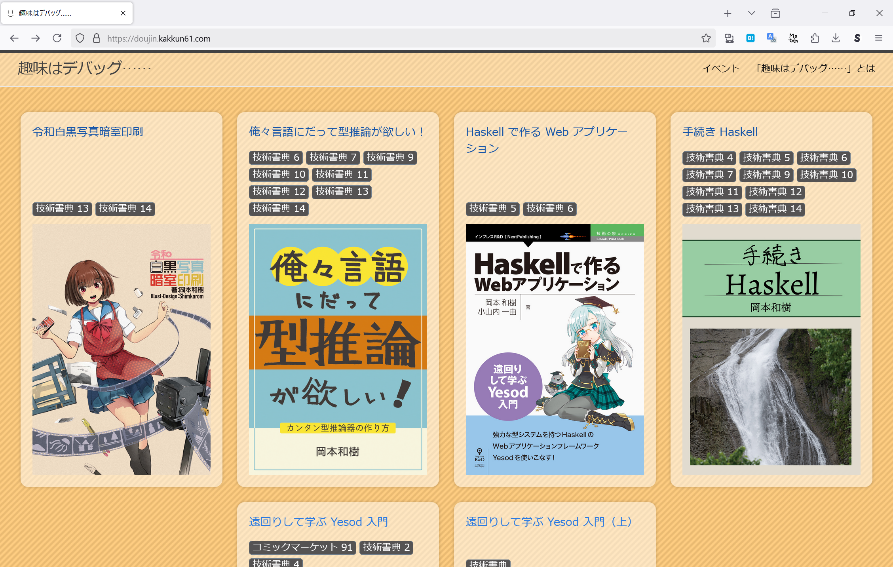
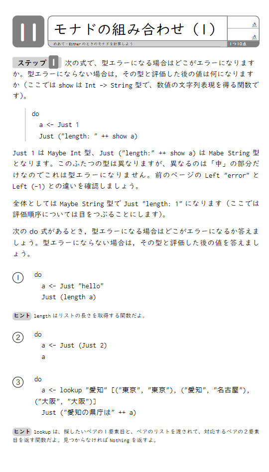

# 『モナドドリル』書いてます

## λ Kansai 2

## 岡本和樹

----

# 自己紹介

- 岡本和樹
- @kakkun61 (Pawoo, mixi2, X)
- 「趣味はデバッグ……」同人誌サークル

----

----

# 『モナドドリル』

- 2024 年春の技術書典 16 から出す出す詐欺をしている
- 方針が二転三転した
- **もうわけ分かんなくなってきたので、今日はみなさんの意見を聞きに決ました**

----

# 主方針

- 「**もっとモナドにいっぱい触れると分かった気になるんじゃないか？**」
- たくさんの具体例で問題を解くことで一般的な規則を理解できるようになる人が多そう（帰納的）
- 一般化された規則を学んで具体を考える人もいるにはいるが少数（演繹的）
- 具体例をいっぱい解くといえば小学校の……

----

<!-- _backgroundColor: black -->

----

<!-- _backgroundColor: black -->

# 最初の方針

- 本当の計算ドリルみたいに問題だけをずらっと並べる
- モナドで「計算しましょう」って何？？？

----

----

# 最初の方針

- 「計算しましょう」は暗黙に「教科書と同じことをしましょう」という意味
- 教科書の存在を前提としている出題方式
- 教科書も書く？？？
- Yet Another Monad Tutorial を世界に増やすだけでは？

----

# 次の方針

- 解説もドリルに含める
- 上半分を解説にして、関連問題を下に掲載する

----

<!-- _backgroundColor: black -->

----

# 次の方針

- ドリルっぽさが減る
- 問題量が減る

----

# 形式の問題

🤔 | 教科書あり | 解説込み | 問題のみ
---|---|---|---
利点 | 丁寧 分かりやすい | 丁寧 いいとこ取り | 問題が多い
欠点 | 教科書がメインに 工数大 当初の方針から遠い | 説明が中途半端に 問題が少ない | 解説がない 分かりにくい

----

# 何をとりあげるか

- 自分が Haskell を書き始めたのは 12 年ほど前
- すでに何でつまづくのか分からなくなってしまった
- そもそもみなさんつまづきましたか？

----

# つまづきポイント

- 定義？
- モナド則？
- 型？
- do 記法？
- IO モナド？
- モナド変換子？
- などなど

----

# 何モナド

- Maybe
- Either
- List
- Reader
- State
- Parser
- IO
- などなど

----

# #λ_Kansai

ぜひ #λ_Kansai ハッシュタグで投稿してください！

- どういう需要があるのか？
- 何でつまづいたか？
- どこまでならもう分かってるのか？
- どういう形式がいいのか？

X・mixi2・ActivityPub・AT Protocol 見に行きます👀

----

# さいごに

「計算ドリル」の判型って同人誌印刷所さんで印刷してくれるのか？？？

----

# 引用

- https://img.fril.jp/img/609204622/l/1928148642.jpg?1685594197
- https://auctions.c.yimg.jp/images.auctions.yahoo.co.jp/image/dr000/auc0111/users/7b740c6005c1a9cd05301c226da0362961ba6028/i-img1200x1200-1605753849gsmlh1521253.jpg
