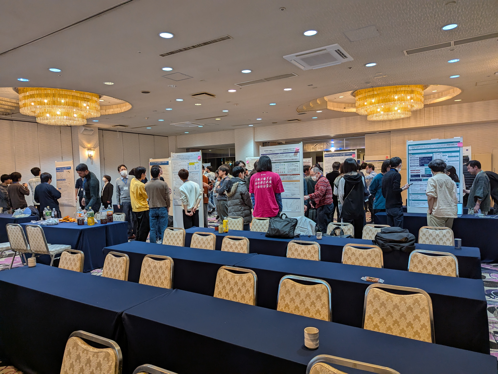

# PPL 2025 感想

## λ Kansai 3

## 岡本和樹

----

# 自己紹介

- 岡本和樹
- [kakkun61.com](https://kakkun61.com/)
- @kakkun61 (Pawoo, mixi2, X)
- 13年前ぐらいに「[Akashi Haskell](https://twitter.com/hashtag/AkashiHaskell)」というイベントやってた

----

----

# 『第27回 プログラミングおよびプログラミング言語ワークショップ』

- 通称 PPL 2025
- 参加（聴者）してきた
- イベントの雰囲気紹介とよかったら参加してみませんか？というお話

----

# PPL とは？

- 日本ソフトウェア科学会（JSSST）の SIG-PPL が開催するイベント
- いわゆる学会
- ですが合宿形式で開催されるちょっとゆるめなイベント
  - 2020年～2024年は合宿形式での開催は一時中止
- 3日間開催
- https://jssst-ppl.org/workshop/2025/

----

# おすすめポイント その一

- **最新の研究のお話が聞ける**
- 学会なんでめちゃくちゃ当たり前だが
- よく理解できない話も当然あるといえばあるが、だいたいバックグラウンドから説明してくれるので、なんとなく分かる
  - そういう分野があるんだなーとか
  - それってまで分かってないんだなーとかだけでも楽しい
- プログラミングに関することならジャンルも結構様々
- https://jssst-ppl.org/workshop/2025/program.html
- https://notestock.osa-p.net/@kakkun61@pawoo.net/view?q=%23PPL

----

----

----
# おすすめポイント その二

- **温泉旅館が楽しめる**
- 合宿形式なので例年温泉旅館で開催される
- 2025年は蒲郡市
- 2019年は花巻市

----

----

----

# おすすめポイント その三

- **そこそこリーズナブル**
- 参加登録料＋相部屋宿泊代（二泊）＋昼食代（二食）……46,000円

----

# あなたも参加してみませんか？
